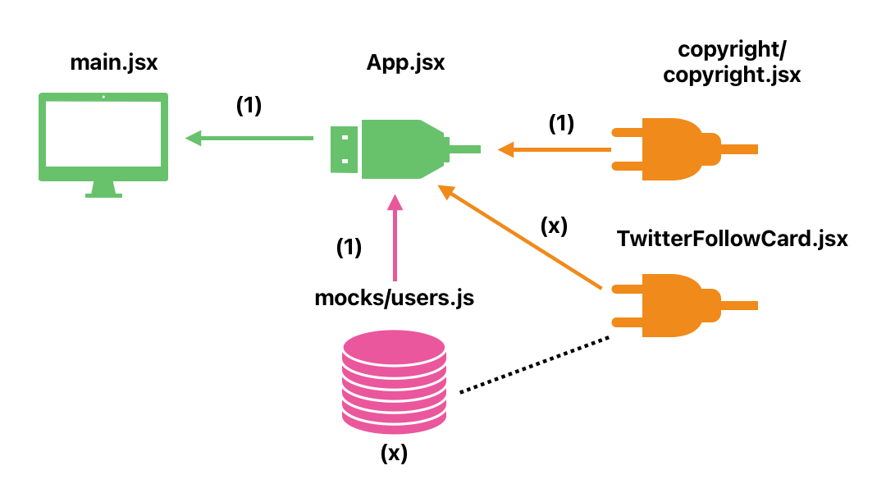
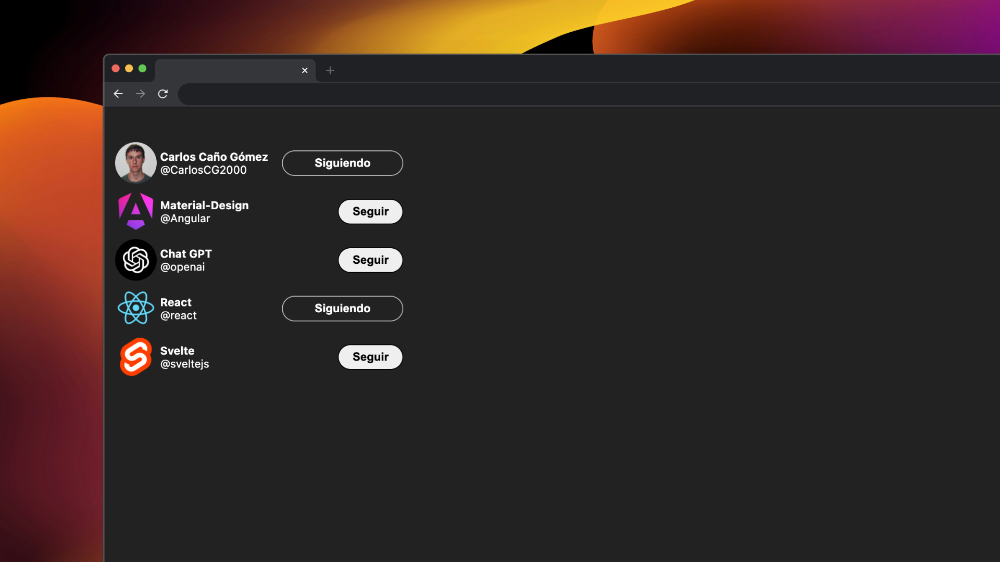

# CREAR ETIQUETAS SEGUIDORES EN X (TWITTER)

## React + Vite (JS + SWC)

Lo primero es pensar en el proyecto como es, que necesitamos, etc.

Trata sobre tarjetas de usuario de X (Twitter) por lo tanto lo primero es crear una tarjeta como componente que se puede importar en el App (componente principal).

Antes de realizar ese paso, podemos probar dentro de la App una tarjeta de forma estática. Una vez comprobada que funciona bien ya se puede pasar a un componente para dejarlo lo más limpio posible la App.

Hay que hacer que el componente de la tarjeta sea dinámico, es decir se le deben de pasar parámetros a la función para renderizarlos de forma diferente luego en la App.

Pasamos a ver la lógica que puede tener el proyecto.
En este caso cuando se pulse el botón de la tarjeta podemos seguir o dejar de seguir a dicho usuario de la tarjeta. Pues para eso necesitaremos un estado como Hook que sera el de estado (useState).

En vez de crear muchas tarjetas (componentes hijo) dentro del componente App de manera manual, es mejor recorrer dichos componentes en un array con un mapeo, por ejemplo.

### ESQUEMA 

  

### INTERFAZ 

  

